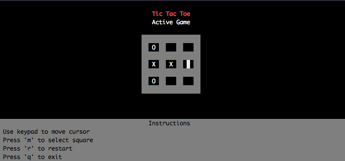

# python-tic-tac-toe

A command line game of tic tac toe for playing against an unbeatable AI opponent.

<p align="center">
    
</p>

## Getting Started

To play the game in your terminal, you can clone this repository and run main.py with Python 3:

```
# clone and cd into directory

$ git clone https://github.com/scottmcallister/python-tic-tac-toe.git
$ cd python-tic-tac-toe


# if you don't have curses and/or want to use virtualenv

$ virtualenv -p python3 env
$ source env/bin/activate
(env) $ pip install -r requirements.txt
(env) $ python main.py
```

### Prerequisites

To run this script you'll need Python 3 and curses installed through pip. 

## Built With

* [Python 3](https://www.python.org/) - Programming language
* [curses](https://docs.python.org/3/howto/curses.html) - UI library